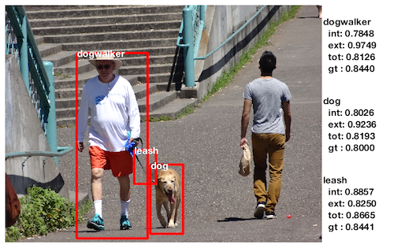

# Situate

Situate is a system for active grounding of visual situations in images. Given an image and a situation definition, Situate localizes objects that make up a situation and produces a confidence score expressing how much the system believes that a given situation is present in an image. 

Situate is an active system, using detected objects to direct search. Confidence that a given situation is present is based on the confidence of constituent classifiers that specific objects are present, the reliability of those classifiers, and the spatial configuration of objects in the scene.

Details can be found in our paper:

Quinn, M. H., Conser, E., Witte, J. M., and Mitchell, M. (2018). [Semantic image retrieval via active grounding of visual situations](https://arxiv.org/abs/1711.00088). In *Proceedings of the 12th International Conference on Semantic Computing*. IEEE.

The Portland State Dog-Walking Images dataset used in the paper can be found [here](http://web.cecs.pdx.edu/~mm/PortlandStateDogWalkingImages.html).

# Setup

Situate was written in and has been tested with:
- Matlab 2016b
- Matlab Parallel Computing Toolbox (optional)
- [MatConvNet](http://www.vlfeat.org/matconvnet/) version 1.0 beta25

If MatConvNet and the pre-trained models are not found at runtime, Situate will try to download and install the needed components, but it's fragile. 

You may need to do a little work to install MatConvNet to `situate/matconvnet`. The MatConvNet installation instructions found at http://www.vlfeat.org/matconvnet/quick/ should do the trick. The pre-trained model can be found at `http://www.vlfeat.org/matconvnet/models/imagenet-vgg-f.mat` and should be saved to `situate/matconvnet`.

# Running Situate

Situate can be run on a single image if the necessary models provided. However, in general, I've been calling it from an experiment handler that defines training and testing images, and specifications of models to train (or load). The experiment handler is run using a few specification files. 

### Experiment parameters
	
The *experiment parameters* file specifies:
- the *situation definition* file
- the *Situate running parameters* file
- training and testing images
- visualization settings
	
example: `params_exp/dogwalking_pos_check.json`

#### Situation definition
	
The *situation definition* file specifies 
- the situation objects that make up the situation
- a mapping from possible labels (found in training data) to the situation objects

example: `situation_definitions/dogwalking.json`

#### Situate running parameters
	
The *Situate running parameters* file defines the functions that are used by situate. These includes the functions used to train and apply the classifier, to define and apply the conditional relationships among objects, and numerous others. A more detailed explanation of options can be found in `situate/README_params_run.md`

example: `params_run/default.json`

A list of several *Situate running parameters* files can be included in the *experiment parameters file*. If they are, each parameterization will be run using the same training and testing images. 

#### Training and testing images

Images used for training are easiest to specify with a directory for each.

	"directory_train" : "/Users/User1/Documents/images/DogWalking_PortlandSimple_train/",
	"directory_test"  : "/Users/User1/Documents/images/DogWalking_PortlandSimple_test/",

Image directories can also be relative directories to a base directory listed in the file `base_image_directories.txt`. For example, the below is equivalent to above

	"directory_train" : "DogWalking_PortlandSimple_train/",
	"directory_test"  : "DogWalking_PortlandSimple_test/",

for a `base_image_directories.json` file such as

	{
		"base_dirs" : [
			"/Users/User1/Documents/images/",
			"/home/user2/Documents/Data/images/",
			"/Users/User3/Desktop/situate images/"
		]
	}

As long as the relative directory exists in one of the provided base directories, it should work. This should make it easier to share *experiment parameters* files on multiple machines that have different paths for image data.

#### Additional settings

	"use_parallel"                  : 0, 
	"run_analysis_after_completion" : 0,
	"num_folds"                     : 1,
	"use_visualizer"                : 0,
	"specific_folds"                : [1],
	"max_testing_images"            : "",
	"testing_seed"                  : ""
			
### Run
	
To run Situate, call `situate.experiment_run` with an experiment parameters file

	situate.experiment_run( 'params_exp/dogwalking_pos_check.json' );

# Defining a Situation

Defining a new situation requires a file that specifies the objects in the situation. To train Situate to recognize the situation, you need a set of positive training example images that have labels specifying the relevant objects in each image. 

### Situation definition file

Situation definition files are in JSON format. They include a description of the situation and a list of constituent objects. The constituent objects have a list of labels that may be present in the training data. 

	{ 
		"situation":{

			"description" : "urn",
			
			"situation_objects" : {

				"black_ball" : {
					"possible_labels" : [
						"black_ball_big",
						"black_ball_small"],
					"urgency_pre"  : "1.0",
					"urgency_post" : ".25"
				},

				"white_ball" : {
					"possible_labels" : [
						"white_ball_big",
						"white_ball_small"],
					"urgency_pre"  : "1.0",
					"urgency_post" : ".25"
				}
			}
		}
	}

Situation definition files are stored in *situation_definitions/*

### Labeled data

The relationships between the constituent objects are inferred from the training data. Each training image should have a label file that specifies tight bounding boxes for situation objects in the image.

Labels can be generated with the tool:
	
	labels_generate('my_image_directory/');

These images and label files will be used to train:
- the situation model
- visual classifiers (which use the pre-trained MatConvNet network linked above and ridge regression)
- bounding box regressors (which uses the same features and performs a box adjustment similar to that discussed [here]())

The reliability of the individual classifiers can be estimated and used to weight the classifiers contribution to situation detections.

# Specifying training and testing sets

Situate can take a bit of time to train models, so it's nice to identify when existing models for a particular training set can be used. To this end, there are several ways to specify the training and testing sets to be used by Situate.

Specifying images for training and testing is done with the following variables in an *experiment parameters* file:
	
	"directory_train"                  : "",
	"directory_test"                   : "",
	"training_testing_split_directory" : "",
	"num_folds"                        : "",
	"specific_folds"                   : [],
	"max_testing_images"               : "",
	"testing_seed"                     : ""

Together, these over determine the specification of training and testing images, so below are a few things one might want to do, and how they would be specified.

#### Separate directories for training/testing

To train on all images in a directory (say, folder_a/) and test on all images in a separate directory (folder_b/), the parameters should be set as below:

	"directory_train"                  : "folder_a/",
	"directory_test"                   : "folder_b/",
	"training_testing_split_directory" : "",
	"num_folds"                        : "",
	"specific_folds"                   : [],
	"max_testing_images"               : "",
	"testing_seed"                     : ""

#### Specifying single directory, file list

If all images are in a single directory and the training and testing images are specified by lists of image names in a file, the parameters should be set as below:

	"directory_train"                  : "folder_a/",
	"directory_test"                   : "folder_a/",
	"training_testing_split_directory" : "data_splits/example_split/",
	"num_folds"                        : "",
	"specific_folds"                   : [],
	"max_testing_images"               : "",
	"testing_seed"                     : ""

The directory *data_splits/example_split/* should contain at least two text files with the naming format 

	[*]fnames_split_[n]_train.txt
	[*]fnames_split_[n]_test.txt

where *n* indicates which split these files specify, and contents that include one file name per line without path information. For example:

	situate_fnames_split_1_train.txt

	situation_image_001.jpg
	situation_image_002.jpg
	situation_image_003.jpg

and

	situate_fnames_split_1_test.txt

	situation_image_004.jpg
	situation_image_005.jpg

#### Specifying separate directories and including file lists

If you would like to use a subset of the available training and testing data present in separate directories, you can specify both separate directories and a directory contain file lists.  Parameters should be set as below:

	"directory_train"                  : "folder_a/",
	"directory_test"                   : "folder_b/",
	"training_testing_split_directory" : "data_splits/example_split/",
	"num_folds"                        : "",
	"specific_folds"                   : [],
	"max_testing_images"               : "",
	"testing_seed"                     : ""

#### Specifying specific folds to run

If there are files that define multiple folds, then the variable *specific_folds* can be used to specify which folds should be run. For example, if there are five folds defined that have image file lists and you want to run only the 2nd and 4th folds, then the parameters should be set as below

	"directory_train"                  : "folder_a/",
	"directory_test"                   : "folder_a/",
	"training_testing_split_directory" : "data_splits/example_split/",
	"num_folds"                        : "",
	"specific_folds"                   : [2,4],
	"max_testing_images"               : "",
	"testing_seed"                     : ""

#### Specifying single directory, seed value

If all images are in a single directory, and you'd like to have situate generate a split between training and testing images, then you have several options. 

You can specify the number of folds, which in turn defines the number of training images per fold. That is, if you set *num_folds* to 3, then 2/3 of images will be used for training, 1/3 for testing. Note: if *num_folds* is set to 1, then 25% of the data is used for testing. 

 parameters should be set as below:

	"directory_train"                  : "folder_a/",
	"directory_test"                   : "folder_a/",
	"training_testing_split_directory" : "",
	"num_folds"                        : "",
	"specific_folds"                   : [],
	"max_testing_images"               : "",
	"testing_seed"                     : ""

When the same directory is specified for training and testing and no split files are provided, split files will be generated and saved in 
*data_splits/[situation description]_[time stamp]/*

#### Specifying maximum number of testing images

For any of the above methods, a maximum number of testing images to run on can be specified and will simply limit the number of images run. It will not change how many images are used for training. For example, if there are 100 images included in the testing image directory,

	"max_testing_images" : 10,

will cause Situate to run on only the first 10 images in that directory.

# Analysis

The results of a Situate experiment are stored in the *results/* directory. There will be a directory for the experiment and individual .mat files for each of the parameterizations that were run during the experiment. 

There are several scripts available for looking at the results of the experiment.  

### Visualizing final workspaces

	analysis.output_final_workspaces.m 

This script generates images displaying the final predicted bounding boxes for situation objects overlaid on the original images. It can be helpful for a subjective analysis of the quality of results. The input can be: path and file name of a .mat results file from the results directory, a directory containing multiple .mat results files, or a cell array of path and file names of .mat results files. The script will generate a new directory in the experiment's results directory with images for each of the final workspaces included in the .mat results file. 

	analysis.output_final_workspaces( 'results/my_experiment/params1_results.mat' );
	analysis.output_final_workspaces( 'results/my_experiment/' );
	analysis.output_final_workspaces( {'results/my_experiment/params1_results.mat', ...
									   'results/my_experiment/params2_results.mat'} );

### Experiment results

Experiments are evaluated in two ways. First, with respect to grounding results, where the localization of objects in positives instances of the situation are evaluated. Second, with respect to retrieval results, where the quality of the resulting situation score is evaluated on the basis of how well it separates positive instances from negative instances of the situation. Both are called using the same function.

	analysis.grounding_and_retrieval.m

The input specifies results from Situate experiments. The input can be the path and filename of a .mat results file, the path of a directory that contains several .mat results files, or a cell array with a combination of any number from either category. For example, each of the following should work:  

	analysis.grounding_and_retrieval( ...
		'results_dir1/results_parameterization_1.mat',
		);

	analysis.grounding_and_retrieval( ...
		'results_dir1/'
		);

	analysis.grounding_and_retrieval( ...
		{
			'results_dir1/results_parameterization_1.mat',
			'results_dir2/',
		});

Multiple Situate parameterizations and collections of test images may be included. However, once all files are combined, each Situation parameterization should have been run for the same set of test images. For example, the following will work

	analysis.grounding_and_retrieval( ...
		{
			'results_parameterization_1_image_set_1.mat',
			'results_parameterization_1_image_set_2.mat',
			'results_parameterization_2_image_set_1.mat',
			'results_parameterization_2_image_set_2.mat 
		});

As will:

	analysis.grounding_and_retrieval( ...
		{
			'results_parameterization_1_image_set_1_and_2.mat',
			'results_parameterization_2_image_set_1.mat',
			'results_parameterization_2_image_set_2.mat
		});

The following will not work:

	analysis.grounding_and_retrieval( ...
		{
			'results_parameterization_1_image_set_1.mat',...
			'results_parameterization_2_image_set_1_and_2.mat ...
		});

#### Grounding

If the input contains results for a run that included any positive instances of the situation (which is recognized by finding an associated label file that contains all of the situation objects), then grounding results will be generated and several figures will be displayed. 

The output includes:
- Object grounding quality, where the the number of objects detected of each type is displayed versus different intersection over union thresholds.
- Situation detections over iteration, where the number of full situation detections (all objects over .5 IOU) is plotted versus the number of iterations Situate ran.
- Histogram of situation support scores
- Final groundings with highest and lowest support, where the four images with the highest support scores are shown with their final grounding, and the four images with the lowest situation support scores are shown with their final grounding. That is, the most confident true positives and the most confident false negatives.

#### Retrieval

If the input contains results that include both positive and negative instances of the situation, retrieval results will also be generated.

The output includes:
- ROC analysis, including AUROC values
- Distribution of the rank of positive instances (considered against negative instances)
- Precision/recall curves
- Final groundings with highest and lowest support among negative instances of the situation, where the four images with the highest support scores are shown with their final grounding, and the four images with the lowest situation support scores are shown with their final grounding. That is, the most confident false positives and the most confident true negatives.

A .csv file containing the retrieval results for each method is written to the results directory.

#### Including external results

Bounding boxes generated externally can also be included in the analysis. The specified boxes and associated confidence values will be used to generate workspaces for each image and to generate a situation support scores for each workspace. The resulting workspaces and support scores are included in the above analysis as a separate method.

To include externally generated boxes, include a path as a second argument. For example

	analysis.grounding_and_retrieval(
		'results_parameterization_1_image_set_1.mat', ...
		'additional_results_dir/' );

The sub-directory structure of `additional_results_dir` should be
	
	additional_results_dir/[situation_desc]/[obj_desc]/[imfname].csv

where:
- `[situation_desc]` matches the situation description in the *situation definition* file used during the experiment.
- `[obj_desc]` matches the objects included in the *situation definition* file.
- `[imfname].csv` contains bounding boxes for image `[imfname].jpg` used in the experiment.
- There is a .csv file for each image used in the experiment.

The contents of each .csv file should specify bounding boxes for one object type in the image. Each row should define one possible bounding box for the object tyep. The format for each row of the .csv is 

`x position, y position, box width, box height, confidence`

To generate the workspaces, the highest confidence box for each object type will be used, so long as it does not have an intersection over union greater than .5 with any of the other boxes included in the workspace. This avoids problems when there are two instances of a specific object type in a situation definition and the boxes were generated independently from one another. This is, however, a greedy mechanism that may not produce the optimal set of bounding boxes.

The situation support score is calculated as a padded geometric mean of the confidence values associated with constituent boxes. 

	
	

	

